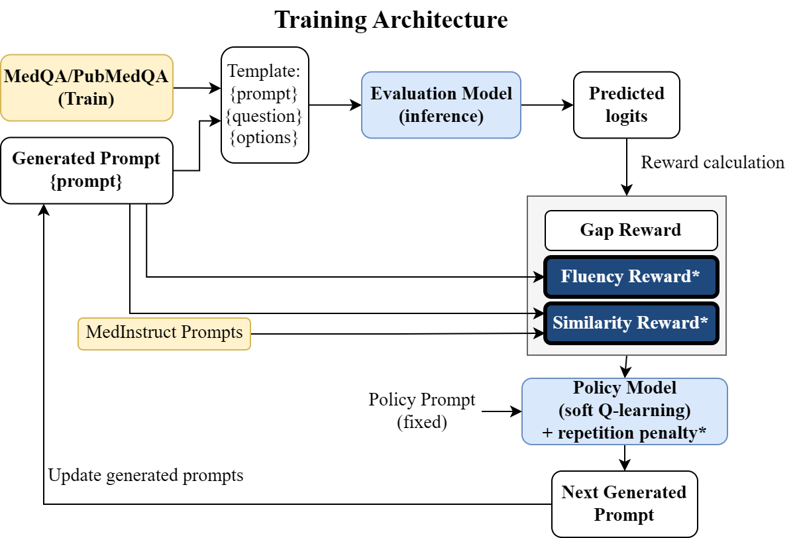
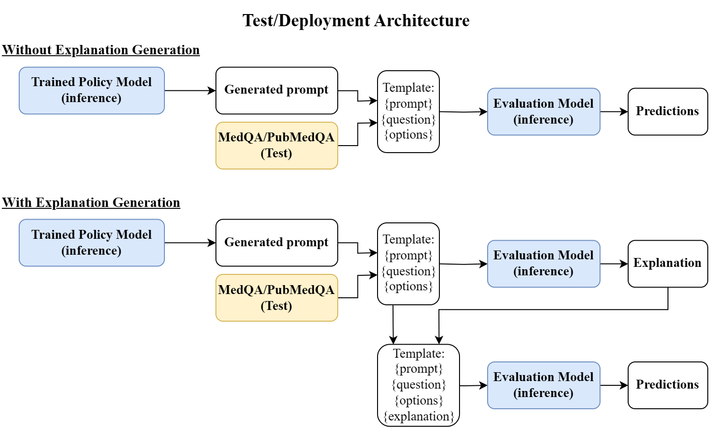

# RLPromptV2
We investigate the influence of prompts on open-source LLMs in the medical question-answering setting, and extend our evaluation to retrieval-augmented question-answering, which  accurately models typical LLM deployments.

Our multi-objective automated prompt optimization method trains a separate prompt-generation module to tune prompts based on various objectives, including fluency and semantic similarity. The generated prompts are subsequently applied directly at inference time. Our method extends an existing method called RLPrompt.

## Equipment and Set-up
1. **Dataset**: Training data (we use 16 examples per class) and Evaluation data is required. We provide processed MedQA and PubMedQA in the example below.
1. **Training**: A GPU is recommended for training the policy LM to generate prompts via soft-Q learning. The GPU should have enough memory for the policy LM, a copy of the policy LM (teacher), the evaluation LM, and the batched data. Alternatively, you can edit the source code to place the evaluation LM on CPU/another GPU.
1. **Inference**: Inference is done on the validation set with the same settings as training, except with parameters frozen and multiple samples being taken. The inference script outputs a JSON file with prompts ranked by reward value.
1. **Evaluation**: The evaluation LM can be any LM we support (need not be the same as the evaluation LM during training). We demonstrate transferability of our prompt from our training scenario to different evaluation LMs and tasks in our full paper. Alternatively, you may take the prompt generated via inference and insert it into your existing LLM pipelines for evaluation of your own system.

## Training and Test system diagram




## Code Release
Currently, the code is withheld while a extension of the main paper is under anonymous peer review. If interested to obtain a copy of the code, submit a request [here](https://forms.gle/mTY1AaX4RhMzUHm1A). We will release the code shortly once the review process is over.


## References
If you find our paper interesting, please kindly cite the following precursor paper:
```
@inproceedings{deng-etal-2022-rlprompt,
    title = "{RLP}rompt: Optimizing Discrete Text Prompts with Reinforcement Learning",
    author = "Deng, Mingkai  and
      Wang, Jianyu  and
      Hsieh, Cheng-Ping  and
      Wang, Yihan  and
      Guo, Han  and
      Shu, Tianmin  and
      Song, Meng  and
      Xing, Eric  and
      Hu, Zhiting",
    editor = "Goldberg, Yoav  and
      Kozareva, Zornitsa  and
      Zhang, Yue",
    booktitle = "Proceedings of the 2022 Conference on Empirical Methods in Natural Language Processing",
    month = dec,
    year = "2022",
    address = "Abu Dhabi, United Arab Emirates",
    publisher = "Association for Computational Linguistics",
    url = "https://aclanthology.org/2022.emnlp-main.222",
    doi = "10.18653/v1/2022.emnlp-main.222",
    pages = "3369--3391"
}
```
